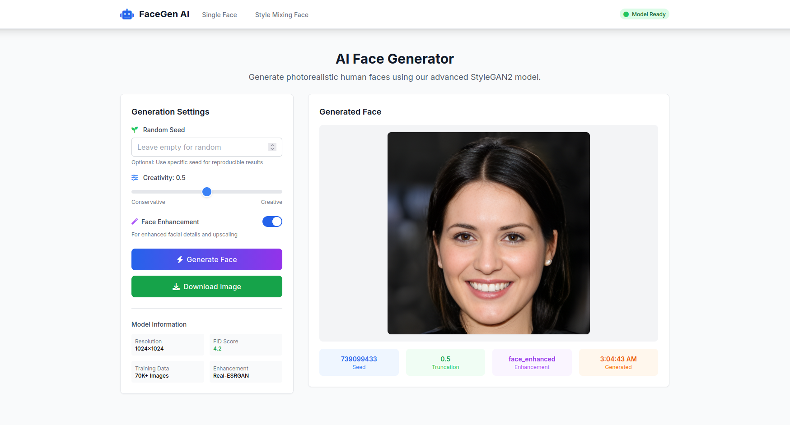
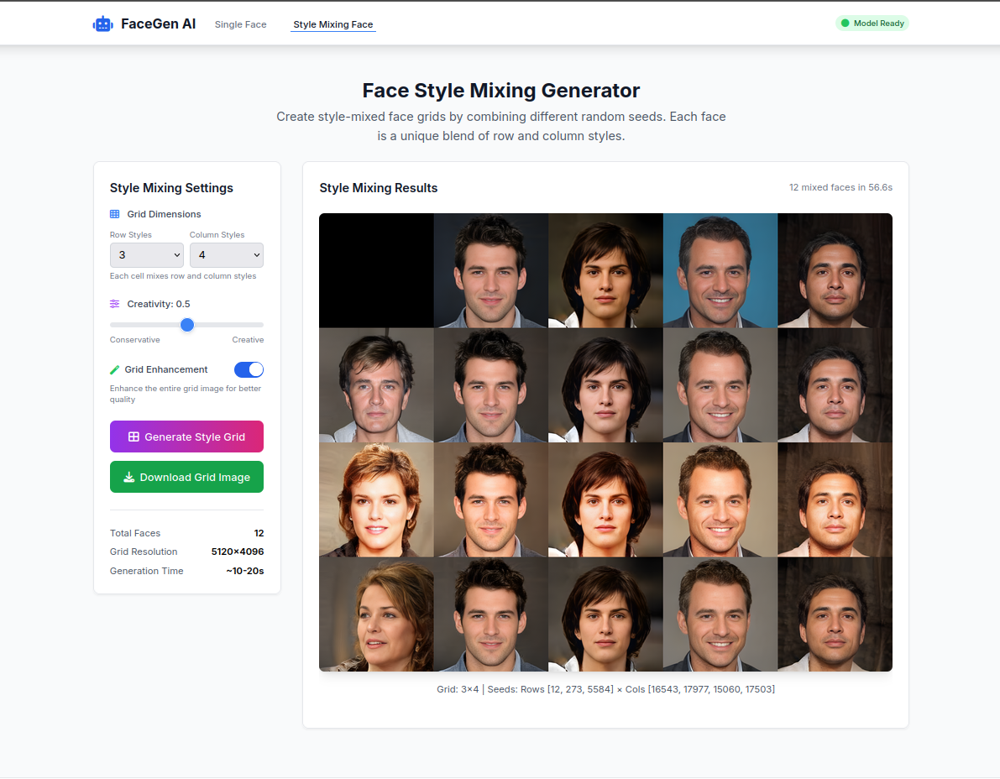

# 🎭 StyleGAN2 Face Generator

[](https://www.python.org/)
[](https://fastapi.tiangolo.com/)
[](https://docker.com/)
[](LICENSE)

A production-ready web application for generating and enhancing AI-generated faces using StyleGAN2 and Real-ESRGAN. Features a modern web interface and RESTful API for seamless integration.




## ✨ Features

- **🎨 High-Quality Generation**: Generate realistic faces using StyleGAN2-ADA
- **🔍 Style Mixing**: Create grid-based style mixing with multiple seeds
- **✨ Face Enhancement**: Super-resolution enhancement with Real-ESRGAN
- **🌐 Web Interface**: Modern, responsive UI built with Tailwind CSS
- **🚀 REST API**: Fully documented API for programmatic access
- **📱 Mobile Friendly**: Responsive design that works on all devices
- **⚡ Fast Inference**: Optimized for quick generation and enhancement
- **🐳 Docker Ready**: Containerized deployment with Docker

## 🚀 Quick Start
```
docker run -p 8000:8000 trongkhanh083/face-generator
```

## 🔧 Installation

**Prerequisites**
- Python 3.7+
- PyTorch 1.7.1+
- GPU (optional but recommended for faster inference)

**Create environment**
```
conda create -n stylegan2 python=3.7
conda activate stylegan2
```

**Clone the repository**
```
git clone --recurse-submodules https://github.com/trongkhanh083/stylegan2-face-generator.git
cd stylegan2-face-generator
```

**Install pytorch**
```
pip install torch==1.7.1+cu110 torchvision==0.8.2+cu110 -f https://download.pytorch.org/whl/torch_stable.html
```

**Install dependencies**
```
pip install -r requirements.txt
```

**Download checkpoint**
```
mkdir -p checkpoints
gdown "1pDzeVD6vqpcZIKzSvrPUELwN95I28Ou2" -O checkpoints/StyleGAN2-256.pkl
```

**Run app**
```
python main.py
```

## 🐳 Docker Deployment

**Build Docker image**
```
docker build -t face-generator .
```

**Run the container**
```
docker run -p 8000:8000 face-generator
```

**Access the Web UI**
```
http://127.0.0.1:8000/api/v1/generate
```

## 📄 License

This project is licensed under the MIT License - see the LICENSE file for details.

## 🙏 Acknowledgments

  - NVlabs for StyleGAN2-ADA-PyTorch
  - Xintao for Real-ESRGAN
  - Tencent ARC for GFPGAN
  - FastAPI for the excellent web framework